# Fancy Wave Hair Salon

Fancy Wave Hair Salon is a two-sided salon booking app for a Flushing hair salon. Customers can view services, switch between English and Chinese, choose a stylist or the first available stylist, book a time, and manage the booking from a tokenized link. Staff can sign in, review appointments, use a day/3-day/week calendar, add appointments, cancel bookings, edit services, manage stylists, set business hours, set stylist-specific hours, and manage gallery photos.

This is a strong portfolio/MVP codebase. The stack is sensible, the booking rules have tests, the database uses RLS and token-scoped RPCs, and the UI is polished. Before treating it as production software, read the risk notes below and the deeper handoff doc in [docs/PROJECT_HANDOFF.md](docs/PROJECT_HANDOFF.md).

## Product Walkthrough

Live staging site: [wongislandd.github.io/fancy-wave-hair-salon](https://wongislandd.github.io/fancy-wave-hair-salon)

Fancy Wave gets one website for both sides of the business: a polished storefront for customers and a private staff workspace for day-to-day salon operations. The public experience helps customers discover the salon, compare services, reserve a time, and manage their appointment without calling. The staff portal gives the shop a single place to manage bookings, service menus, stylist coverage, hours, and gallery photos.

Screenshots below reflect the staging website with staging and sample booking data.

### 1. Storefront

The landing page presents the salon from the first screen: brand, booking call-to-action, bilingual controls, popular services, location details, and gallery photography. A new customer can understand what the salon offers and move straight into booking.


Storefront capabilities:

- English and Chinese language switcher.
- Clear book-online action in the header.
- Service menu with prices and durations.
- Salon address, contact details, and hours.
- Gallery photos for atmosphere and finished styles.
- Responsive layout for desktop and phone visitors.

### 2. Online Reservation Flow

The reservation flow is guided step by step so customers send the shop complete appointment information.

Customers start by picking a service. Each card shows what the service includes, how long it takes, and the price.


Next, customers choose a stylist or let the system show the first available opening across eligible stylists.


The time picker shows bookable slots based on salon hours, stylist hours, service length, minimum booking notice, and existing appointments.


The details step collects the customer name, email, phone number, and notes for the stylist.


After booking, customers get a confirmation page with the appointment reference, calendar link, and self-service reschedule or cancellation controls.


Reservation capabilities:

- Guided service, stylist, time, and details flow.
- Stylist-aware availability and automatic calendar blocking.
- Customer notes for preferences and first-visit details.
- Confirmation page with booking reference.
- Tokenized customer management link for rescheduling and cancellation.
- Email-ready booking confirmation flow.

### 3. Staff And Admin Portal

The admin portal gives staff a private workspace separate from the public website.

Staff access starts at a dedicated sign-in screen.


The appointment dashboard shows current bookings, customer contact details, service information, status, and quick filters.


Opening an appointment reveals the full reservation record, customer notes, contact details, previous visit history, and staff-only notes.


Staff can add appointments for walk-ins or phone calls, keeping online and offline bookings in the same schedule.


The calendar turns appointments into visible blocks, with day, three-day, and week views.


The service editor controls the public menu: bilingual names and descriptions, price, customer-facing duration, calendar block length, active status, order, and stylist coverage.


The stylist editor manages staff profiles, bios, specialties, assigned services, active status, and stylist-specific hours.


Business hours control the weekly salon schedule and special closures or adjusted days. These rules directly affect customer availability.


The gallery manager controls homepage photos, ordering, visibility, and bilingual descriptions.


Admin capabilities:

- Private staff sign-in.
- Appointment dashboard with filters and customer search.
- Appointment detail drawer with history and notes.
- Staff-created appointments for phone calls and walk-ins.
- Day, three-day, and week calendar views.
- Service menu editor with pricing and scheduling controls.
- Stylist profile editor with service coverage and hours.
- Weekly business hours and special exceptions.
- Homepage gallery photo management.

### 4. Mobile-Friendly Preview

The same customer and staff workflows adapt to a phone-sized layout with touch-friendly controls, stacked forms, horizontal admin navigation, and sticky booking actions.

<table>
  <thead>
    <tr>
      <th>Capability</th>
      <th>Mobile view</th>
    </tr>
  </thead>
  <tbody>
    <tr>
      <td>Storefront landing page</td>
      <td>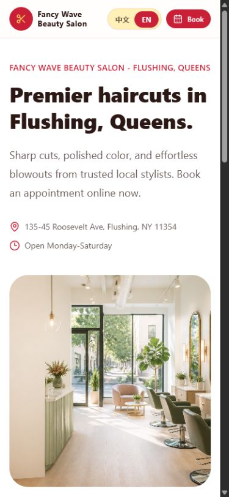</td>
    </tr>
    <tr>
      <td>Pick a service</td>
      <td>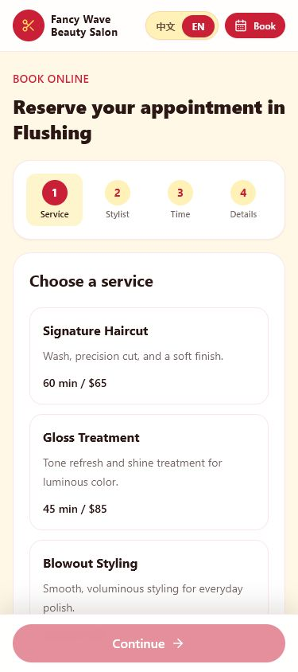</td>
    </tr>
    <tr>
      <td>Choose a stylist</td>
      <td>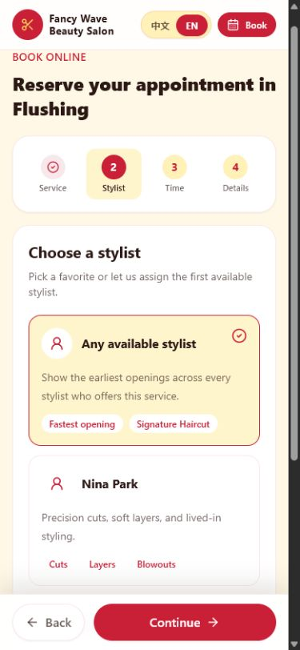</td>
    </tr>
    <tr>
      <td>Select a time</td>
      <td>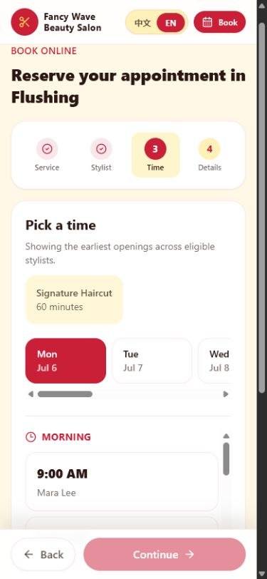</td>
    </tr>
    <tr>
      <td>Enter customer details</td>
      <td>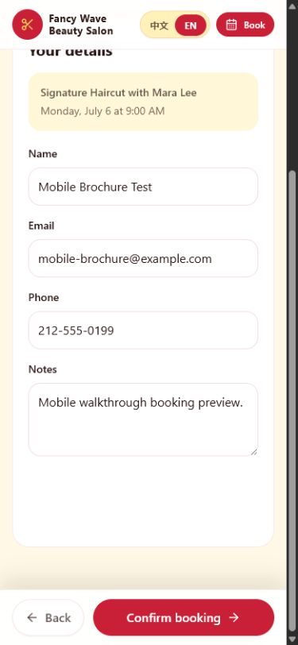</td>
    </tr>
    <tr>
      <td>Confirmation and self-service</td>
      <td>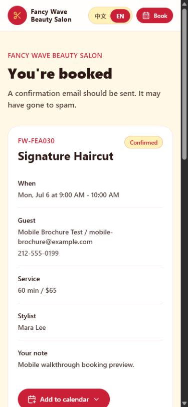</td>
    </tr>
    <tr>
      <td>Staff sign in</td>
      <td>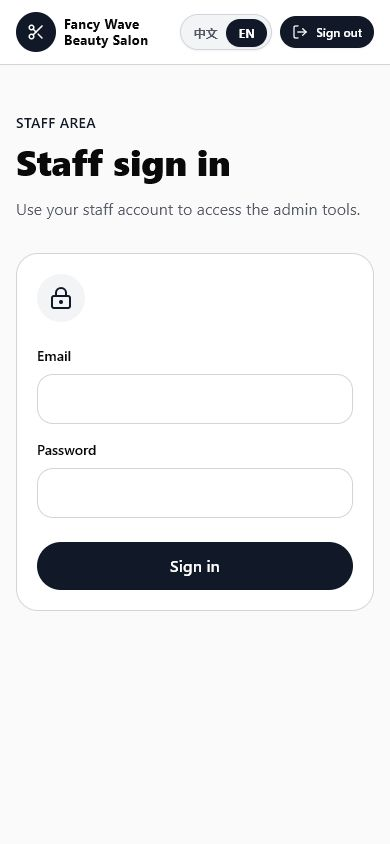</td>
    </tr>
    <tr>
      <td>Appointment dashboard</td>
      <td>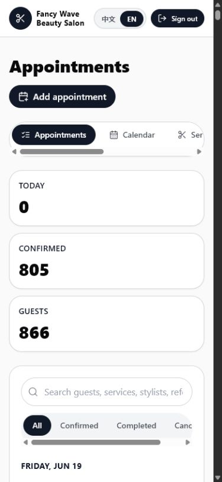</td>
    </tr>
    <tr>
      <td>Appointment detail</td>
      <td>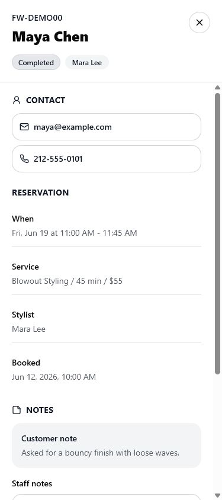</td>
    </tr>
    <tr>
      <td>Add appointment</td>
      <td>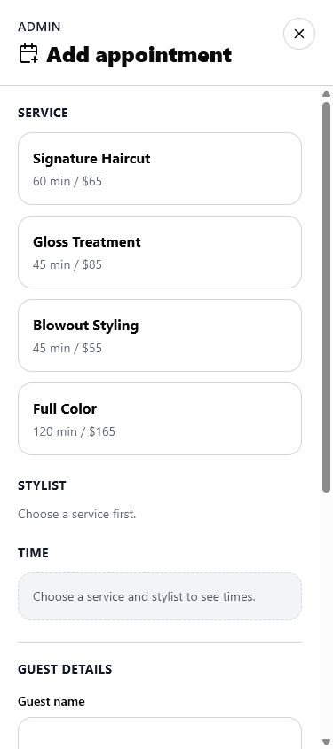</td>
    </tr>
    <tr>
      <td>Calendar with appointments</td>
      <td>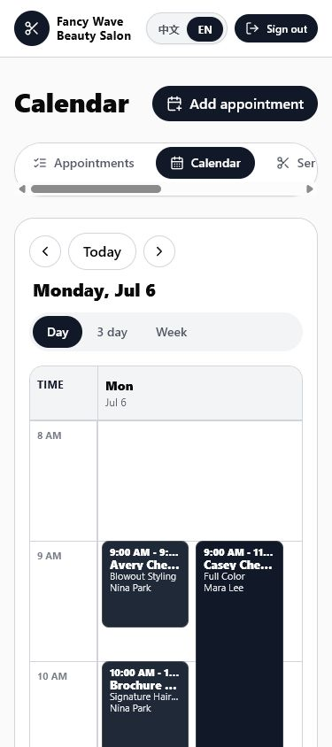</td>
    </tr>
    <tr>
      <td>Service management</td>
      <td>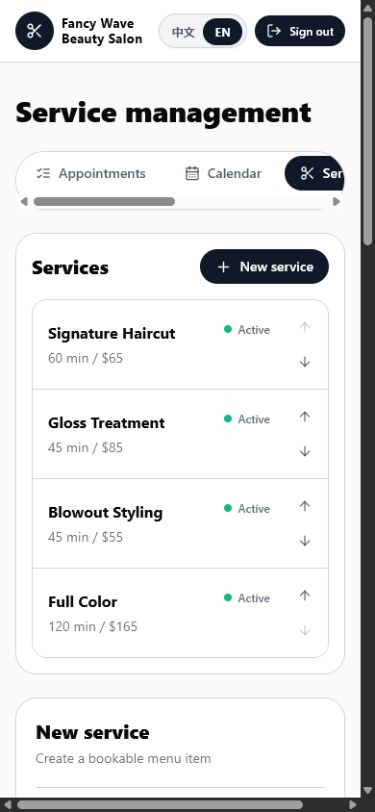</td>
    </tr>
    <tr>
      <td>Stylist management</td>
      <td>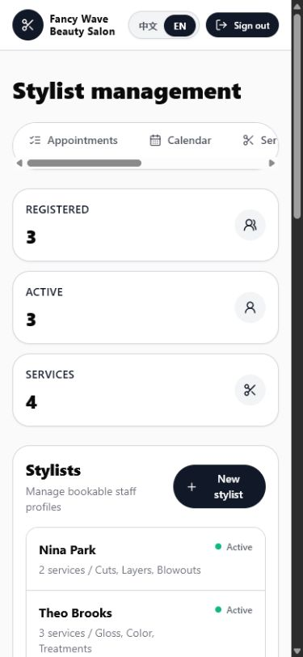</td>
    </tr>
    <tr>
      <td>Business hours</td>
      <td>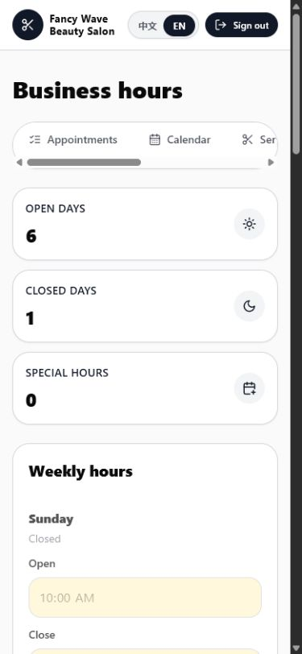</td>
    </tr>
    <tr>
      <td>Gallery management</td>
      <td>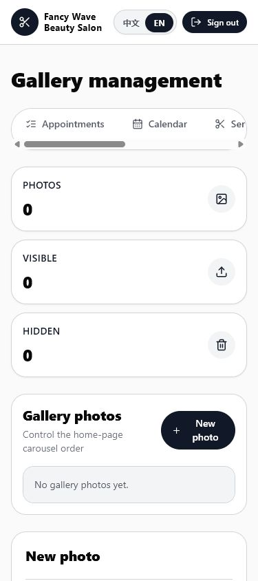</td>
    </tr>
  </tbody>
</table>

## Quick Start

AI agents and contributors should read [AGENTS.md](AGENTS.md) before choosing an environment. The default development target for AI-assisted work is staging.

```bash
npm install
npm run dev
```

Open `http://localhost:5173`.

On Windows PowerShell, execution policy may block `npm.ps1`. Use `npm.cmd` if that happens:

```powershell
npm.cmd run dev
```

## Runtime Modes

The app has two data modes behind the same UI:

- **Demo data mode**: used when Supabase env vars are missing or still contain the placeholder key. Data is stored in memory in `src/lib/demo-data.ts`.
- **Supabase mode**: used when `VITE_SUPABASE_URL` and `VITE_SUPABASE_PUBLISHABLE_KEY` are set in `.env`, `.env.staging.local`, `.env.production.local`, or the deploy environment.

For most development against hosted data, use the staging project:

```bash
cp .env.staging.example .env.staging.local
npm run dev:staging
```

Fill `.env.staging.local` with the staging Supabase URL and publishable key before relying on staging. Vite also loads generic `.env` files, so the mode-specific local file keeps staging runs from accidentally inheriting another environment.

Staff admin access requires Supabase Auth. Create a real Supabase Auth user and add a matching row in `staff_profiles`.

## Scripts

```bash
npm run dev:staging
npm test -- --run
npm run lint
npm run build
npm run build:staging
npm run build:staging:github-pages
npm run build:prod
npm audit --omit=dev
```

Current verification result from the handoff review:

- `npm.cmd test -- --run`: 71 tests passed across 18 files.
- `npm.cmd run lint`: passed.
- `npm.cmd run build`: passed. Vite warns that the main JS chunk is larger than 500 kB.
- `npm.cmd audit --omit=dev`: found 0 production vulnerabilities.

The test run also emits React Router v7 future-flag warnings. They are not failures, but they should be handled during a React Router upgrade.

## Stack

- Vite, React 18, TypeScript, React Router
- Tailwind CSS with a small custom brand theme
- TanStack Query for async state and cache invalidation
- React Hook Form plus Zod for form validation
- Supabase Auth, Postgres, Row Level Security, Storage, and RPC functions
- date-fns and browser `Intl` APIs for calendar/time-zone formatting
- lucide-react icons
- Vitest and Testing Library
- Cloudflare Pages deployment target

## App Routes

```text
/                         Public landing page
/book                     Customer booking flow
/booking-confirmed/:token Booking management page in confirmed state
/manage-booking/:token    Customer reschedule/cancel page
/admin/login              Staff login
/admin                    Staff appointment list
/admin/calendar           Staff calendar
/admin/services           Service editor
/admin/stylists           Stylist editor and stylist hours
/admin/hours              Salon business hours
/admin/gallery            Gallery photo manager
```

## Project Map

```text
src/App.tsx                         Route table
src/main.tsx                        React root, QueryClient, language provider
src/styles.css                      Tailwind entry and shared CSS utilities
src/components/AppLayout.tsx        Global header, language switcher, booking/sign-out action
src/components/AdminShell.tsx       Admin page guard and admin navigation
src/components/AdminAddAppointmentDialog.tsx
src/components/AppointmentDetailDrawer.tsx
src/components/GalleryCarousel.tsx
src/pages/*                         Public and admin screens
src/lib/data.ts                     Main data facade for demo and Supabase backends
src/lib/booking.ts                  Booking/time-zone/availability utilities
src/lib/admin.ts                    Admin form schemas and appointment helpers
src/lib/calendar.ts                 Calendar layout utilities
src/lib/i18n.tsx                    Translation catalog and language provider
src/lib/localization.ts             Localized service/booking helpers
src/lib/*-api.ts                    Thin wrappers around Supabase RPCs
src/lib/types.ts                    Shared TypeScript domain types
supabase/migrations                 Database schema, RLS, RPCs, storage policies
supabase/seed.sql                   Local demo seed data for Supabase
public/assets/salon-hero.png        Main salon image used by landing and demo gallery
```

## Architecture

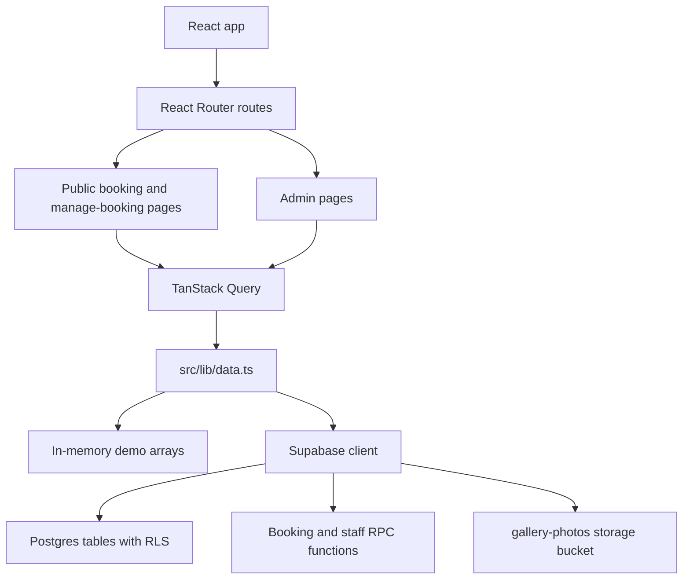

The important design choice is `src/lib/data.ts`: pages call one facade and do not care whether the backend is demo data or Supabase. That makes the app easy to demo, but it also means every booking rule or admin mutation must stay consistent in two places: TypeScript demo logic and Postgres RPC/table logic.

## Booking Model

Booking availability is built from:

- service duration
- salon business hours
- optional stylist-specific hours
- active stylist/service assignment
- existing confirmed appointments
- minimum booking notice
- cancellation/reschedule cutoff

For Supabase, the authoritative booking operations are RPCs:

- `get_available_slots`
- `create_appointment`
- `get_booking_by_token`
- `reschedule_booking_by_token`
- `cancel_booking_by_token`
- `create_staff_appointment`
- `save_stylist_profile`

Public customers should not query or mutate `appointments` directly. Customer management uses long random tokens. The raw token appears in the customer URL, but only `management_token_hash` is stored in Postgres.

## Supabase Setup

Copy the env template:

```bash
cp .env.example .env
```

Start local Supabase and reset the database:

```bash
supabase start
supabase db reset
```

Create a staff Auth user in Supabase Studio, then add a matching staff profile:

```sql
insert into public.staff_profiles (user_id, display_name, role)
values ('<auth-user-id>', 'Demo Staff', 'manager');
```

Set these values in `.env`:

```text
VITE_SUPABASE_URL=http://127.0.0.1:54321
VITE_SUPABASE_PUBLISHABLE_KEY=<local-or-hosted-publishable-key>
```

Never commit `.env`.

### Hosted Staging and Production

Create separate Supabase projects for staging and production.

For staging development:

```bash
cp .env.staging.example .env.staging.local
```

Set staging values in `.env.staging.local`, then run:

```bash
npm run dev:staging
```

For local production-build checks, copy `.env.production.example` to `.env.production.local` and fill in production values. Only use production Supabase for release checks, production deploys, or explicit production debugging.

```bash
npm run build:staging
npm run build:prod
```

Never commit real env files or service-role keys. The frontend should only receive:

```text
VITE_SUPABASE_URL
VITE_SUPABASE_PUBLISHABLE_KEY
```

## Database Model

Main tables:

- `salon_settings`: salon name, time zone, slot interval, booking notice, cancellation cutoff.
- `services`: bilingual service catalog with price, duration, active flag, and display order.
- `stylists`: bilingual bookable staff profiles.
- `stylist_services`: many-to-many mapping from stylists to services.
- `business_hours`: weekly salon schedule.
- `stylist_hours`: optional stylist overrides that fall back to salon hours.
- `appointments`: booking records with service/stylist snapshots, notes, status, and token hash.
- `email_logs`: simulated confirmation/reschedule/cancel email records.
- `appointment_events`: audit trail for booking lifecycle actions.
- `staff_profiles`: staff role rows tied to `auth.users`.
- `gallery_photos`: metadata for public gallery images stored in Supabase Storage.

The schema also defines:

- RLS on every app table.
- Public read access for active catalog/hours/gallery records.
- Staff-only mutation policies.
- An exclusion constraint to prevent overlapping confirmed appointments for the same stylist.
- A public `gallery-photos` storage bucket with staff-only object mutation policies.

## Design Assessment

Overall verdict: good, especially for a new grad handoff, portfolio demo, or small internal MVP. The app has clear product scope, a coherent visual system, tested booking rules, a real database model, and security-aware public booking flows.

Main strengths:

- The public booking path is easy to understand and visually polished.
- The admin surface covers the core salon operations instead of stopping at booking creation.
- Time-zone and slot-overlap logic are isolated in `src/lib/booking.ts` and covered by tests.
- Supabase RLS/RPC design avoids exposing customer appointment rows directly.
- Demo mode makes local development and portfolio review easy.
- Bilingual content is supported across public and admin surfaces.

Main handoff risks:

- `src/lib/data.ts` is over 1,000 lines and mixes demo storage, Supabase queries, RPC wrappers, gallery storage, admin mutations, and row mappers.
- Booking rules exist both in TypeScript demo logic and Postgres RPCs. Keep them synchronized.
- Several page components are large, especially booking, stylists, gallery, calendar, and add-appointment dialog.
- There are good unit/component tests, but no end-to-end test that books, reschedules, cancels, and verifies admin state.
- The production build is currently one large app chunk. Route-level code splitting would lighten the public path.
- `AppLayout` shows a sign-out button on `/admin/login` because that route starts with `/admin`.
- If salon settings become editable, the frontend should stop assuming the demo `America/New_York` settings in helper functions.

## Cloudflare Pages

Cloudflare Pages remains the production deployment target. The existing `.github/workflows/cloudflare-pages.yml` workflow builds from `main` with production Supabase repository secrets and deploys to the Cloudflare Pages project.

Build command:

```bash
npm run build
```

`npm run build:prod` is an explicit equivalent for production-mode builds. Staging previews can use `npm run build:staging` with staging environment variables.

Output directory:

```text
dist
```

Required environment variables:

```text
VITE_SUPABASE_URL
VITE_SUPABASE_PUBLISHABLE_KEY
```

Because this is a single-page app, configure fallback routing to serve `index.html` for nested paths like `/book` and `/manage-booking/:token`.

## GitHub Pages Staging

GitHub Pages is the hosted staging deployment target for this repo:

```text
https://wongislandd.github.io/fancy-wave-hair-salon/
```

The staging workflow is `.github/workflows/github-pages-staging.yml`. It builds with:

```bash
npm run build:staging:github-pages
```

That script uses Vite staging mode and the `/fancy-wave-hair-salon/` base path required for a repository GitHub Pages site. The workflow also copies `dist/index.html` to `dist/404.html` so nested SPA routes can reload on GitHub Pages.

Required GitHub repository secrets for staging:

```text
STAGING_VITE_SUPABASE_URL
STAGING_VITE_SUPABASE_PUBLISHABLE_KEY
```

These should point to the staging Supabase project only. Production Cloudflare secrets should continue pointing to production.

## Recommended Next Work

1. Split `src/lib/data.ts` into smaller modules: public catalog, appointments, admin, gallery, mappers, and demo repository.
2. Add one Playwright or Cypress happy-path test for booking, rescheduling, cancellation, and staff visibility.
3. Fix admin login polish so the global header does not show `Sign out` on `/admin/login`.
4. Add route-level lazy loading for admin screens and the gallery/admin-heavy surfaces.
5. Add real email delivery through a Supabase Edge Function and a provider such as Resend.
6. Add holiday closures, PTO, and one-off blocked time.
7. Add customer lookup by booking reference plus email.
8. Add revenue/popular-service dashboard cards.
10. Consider Stripe deposits if no-shows matter.

## Deep Handoff Doc

Read [docs/PROJECT_HANDOFF.md](docs/PROJECT_HANDOFF.md) before making substantial changes. It explains the architecture, data flows, common change paths, verification commands, and design risks in more detail.
