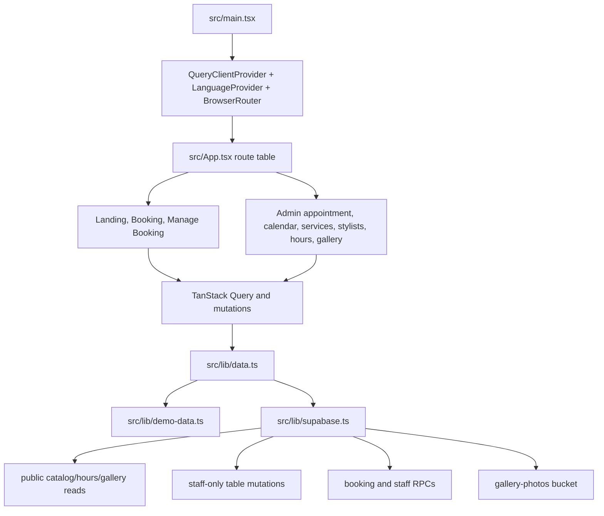

# Fancy Wave Hair Salon Handoff And Design Review

Review date: 2026-07-05

This document is for a new grad taking over the project. It explains what exists, how the pieces fit together, what is good about the design, and where to be careful.

## Executive Summary

Fancy Wave Hair Salon is a strong small-app codebase. It is not just a static website: it has customer booking, token-based booking management, staff authentication, admin appointment operations, calendar views, service/stylist/hours/gallery management, bilingual copy, Supabase migrations, RLS, RPC functions, and a demo backend.

The design is good for a portfolio project or MVP. The main thing to watch is complexity concentration. `src/lib/data.ts` is the central facade and currently does too much. It keeps the pages simple, but it also hides a lot of backend behavior in one large file. A new owner can work safely in this codebase by understanding that file, the Supabase migrations, and the booking utility tests first.

## Product Surface

Customer-facing:

- Landing page with hero image, services, location, map, and gallery.
- Multi-step booking flow: service, stylist, time, details.
- "Any available stylist" option that aggregates slots across eligible stylists.
- Booking confirmation path that routes to the management page.
- Tokenized management page for reschedule/cancel actions.
- English/Chinese language switcher.

Staff-facing:

- Login page.
- Appointment list with metrics, search, status filter, add appointment action, and detail drawer.
- Calendar with day, 3-day, and week views.
- Service catalog editor.
- Stylist editor with service assignment and stylist-specific hours.
- Salon business-hours editor.
- Gallery photo manager.

## Stack Assessment

The stack is appropriate for the project size:

| Area | Choice | Assessment |
| --- | --- | --- |
| Frontend | Vite, React 18, TypeScript | Good. Fast dev loop and enough structure without heavy framework overhead. |
| Routing | React Router | Good for this SPA. Future v7 warnings should be handled later. |
| Async state | TanStack Query | Good. Query keys and invalidation are readable. |
| Forms | React Hook Form and Zod | Good where used. Some admin forms still manage local state manually. |
| Styling | Tailwind CSS | Good for a portfolio app. Repeated field/card/button classes are candidates for extraction. |
| Backend | Supabase Auth, Postgres, RLS, RPC, Storage | Strong choice. Gives a real backend without a custom server. |
| Tests | Vitest and Testing Library | Good base coverage. Needs e2e coverage before production confidence. |
| Deployment | Cloudflare Pages | Good for a static SPA. Needs SPA fallback routing configured. |

## Is The Design Good?

Yes, with caveats.

What is good:

- The product is coherent. It solves one concrete business workflow.
- The public UI looks polished and credible, with real visual assets instead of placeholder-only layout.
- The admin UI covers real operational needs, not just CRUD demos.
- The database model is thoughtful: appointment snapshots, token hashes, audit logs, simulated email logs, business/stylist hours, and overlap prevention.
- Public appointment management is token-scoped and does not expose appointment IDs as authorization secrets.
- Booking/time-zone utilities are isolated and tested.
- Demo mode is useful for portfolio review, offline development, and avoiding dependence on a live Supabase project.

What is not yet production-grade:

- There is no e2e test proving the full customer and staff workflow works against a running app.
- Real email is not implemented; `email_logs` are simulated.
- Admin access is guarded in the UI and by RLS, but the UI guard is component-level, not route-level.
- `src/lib/data.ts` is large enough that future changes are more error-prone than they need to be.
- Booking logic exists in both TypeScript and SQL. A change in one must be mirrored in the other.
- The build ships one large JS chunk.

## Architecture



The frontend uses pages as feature containers. Pages call `useQuery` and `useMutation` directly. Shared domain logic is in `src/lib`, and shared UI shells/components are in `src/components`.

The backend is schema-first. Supabase migrations define tables, RLS policies, RPCs, grants, storage policies, constraints, and seed data.

## Important Files

| File | Why it matters |
| --- | --- |
| `src/App.tsx` | Complete route table. Start here to understand app navigation. |
| `src/main.tsx` | Global providers: query cache, language context, router. |
| `src/components/AppLayout.tsx` | Global header, language toggle, public booking CTA, admin sign-out action. |
| `src/components/AdminShell.tsx` | Admin navigation and session check. |
| `src/lib/data.ts` | Main facade for all demo and Supabase reads/mutations. Most feature changes touch this. |
| `src/lib/booking.ts` | Slot derivation, time-zone conversion, overlap checks, price/date formatting. |
| `src/lib/admin.ts` | Admin Zod schemas and appointment helper functions. |
| `src/lib/calendar.ts` | Calendar date movement and event layout lanes. |
| `src/lib/i18n.tsx` | Translation strings and language provider. |
| `src/lib/localization.ts` | Helpers that choose English or Chinese service/booking text. |
| `src/lib/booking-api.ts` | Customer booking RPC wrapper functions. |
| `src/lib/admin-api.ts` | Staff RPC wrapper functions. |
| `src/lib/types.ts` | Shared domain types. |
| `supabase/migrations/20260704000100_initial_schema.sql` | Core schema, RLS, RPCs, grants. |
| `supabase/migrations/20260705021326_harden_live_schema.sql` | RLS/function hardening. |
| `supabase/migrations/20260705022121_add_gallery_storage.sql` | Gallery metadata table and storage policies. |
| `supabase/seed.sql` | Local Supabase seed data. |

## Data Flow: Customer Booking

1. `BookingPage` loads public services with `listPublicServices`.
2. After a service is selected, it loads eligible stylists with `listPublicStylists(serviceId)`.
3. The customer can choose a stylist or `any`.
4. `getAvailableSlots(service, date, stylist?)` returns slots.
5. In demo mode, availability is derived in TypeScript with `deriveAvailableSlots`.
6. In Supabase mode, availability comes from the `get_available_slots` RPC. For `any`, the frontend asks for each eligible stylist and merges the results.
7. `bookAppointment` creates the booking.
8. In Supabase mode, `create_appointment` validates service/stylist/hours/overlap, inserts the appointment, stores a hashed management token, logs an event, and logs a simulated email.
9. The UI navigates to `/booking-confirmed/:token`.

## Data Flow: Customer Manage Booking

1. `ManageBookingPage` reads the token from the URL.
2. `loadBookingByToken` calls the demo token map or the `get_booking_by_token` RPC.
3. The page displays booking details and whether online management is still allowed.
4. Rescheduling calls `rescheduleManagedBooking`, which validates cutoff, hours, and overlap.
5. Cancellation calls `cancelManagedBooking`, which updates status and writes event/email log records.

Important security point: the raw token is only in the URL and customer-facing email/log body. The database stores `management_token_hash`.

## Data Flow: Staff Admin

1. Staff sign in through `AdminLoginPage`.
2. Staff authentication requires Supabase Auth.
3. `AdminShell` calls `isStaffSignedIn`; unauthenticated users are redirected to `/admin/login`.
4. Admin pages call `listAdminAppointments`, `listAdminServices`, `listAdminStylists`, `listBusinessHours`, `listStylistHours`, and gallery functions.
5. Mutations invalidate relevant TanStack Query keys.
6. Supabase RLS and staff RPCs provide the real authorization boundary.

## Database Design

The schema is designed around operational consistency:

- `appointments` snapshots service/stylist names, duration, and price so later catalog edits do not rewrite booking history.
- `no_overlapping_confirmed_appointments` prevents double-booking one stylist for overlapping confirmed appointments.
- `staff_profiles` links app authorization to Supabase Auth users.
- `email_logs` and `appointment_events` support auditability even before real email exists.
- `business_hours` define salon defaults.
- `stylist_hours` override salon hours per stylist and day.
- `gallery_photos` stores metadata, while image objects live in Supabase Storage.

RLS model:

- Public users can read active services/stylists, stylist-service mappings, hours, and active gallery photos.
- Public users do not directly read `appointments`.
- Public booking and management operations go through token-aware RPCs.
- Authenticated users need a row in `staff_profiles` to mutate operational data.

## Frontend Design System

The visual system is simple and consistent:

- Warm cream background.
- Deep red primary actions.
- Gold/yellow accent treatment on booking CTA and highlights.
- Rounded cards, soft shadows, and lucide icons.
- Reusable `.focus-ring`.
- Responsive grids on landing/admin pages.

Live visual review notes:

- Desktop landing page is strong. The brand, hero image, and CTA are immediately visible.
- Mobile landing and booking are usable and readable.
- Mobile header is cramped: the salon name wraps into three lines and the booking button becomes very small.
- Admin login is polished, but the global header shows `Sign out` on `/admin/login`, which is confusing.
- Admin login is now a blank staff form, but the global header still shows `Sign out` on `/admin/login`.

## Internationalization

The app supports `en` and `zh`.

Key files:

- `src/lib/i18n.tsx`: translation dictionaries and provider.
- `src/lib/localization.ts`: helpers for choosing localized service and booking text.
- `src/lib/language-context.ts`: context type.
- `src/lib/use-language.ts`: hook with provider guard.

Current behavior:

- Saved language preference in `localStorage` wins.
- Without a saved preference, the app checks browser language metadata from `navigator.languages` / `navigator.language`.
- If no supported language can be inferred, the default language is English.
- The provider updates `document.documentElement.lang` when the app language changes.
- Service records have English and Chinese fields.
- Appointment records store English and Chinese service-name snapshots.

## Testing Strategy

Current test coverage is good for core logic:

- Booking API wrapper tests.
- Booking availability/time-zone tests.
- Admin helper/schema tests.
- Calendar layout tests.
- Localization tests.
- Data facade tests.
- Demo data tests.
- Component tests for layout, admin shell, gallery carousel, add appointment dialog, landing page, and admin gallery page.

Commands used during this review:

```powershell
npm.cmd test -- --run
npm.cmd run lint
npm.cmd run build
npm.cmd audit --omit=dev
```

Results:

- Tests: 71 passed across 18 files.
- Lint: passed.
- Build: passed.
- Audit: 0 production vulnerabilities.

Known gaps:

- No browser e2e test for the full booking lifecycle.
- No Supabase integration test that resets local DB and exercises RPCs directly.
- No visual regression test for desktop/mobile layout.
- No test around admin login header behavior.

## Build And Deployment Notes

Cloudflare Pages:

- Build command: `npm run build`
- Output directory: `dist`
- Env vars: `VITE_SUPABASE_URL`, `VITE_SUPABASE_PUBLISHABLE_KEY`

SPA routing:

- Configure fallback to `index.html` so nested routes work after refresh.

Build warning:

- The main JS bundle is about 665 kB minified in the current build.
- Route-level lazy loading is the likely fix, especially for admin pages.

## Common Change Recipes

### Add A Service Field

1. Add the column in a new Supabase migration.
2. Update `Service` in `src/lib/types.ts`.
3. Update row mapping in `mapService` in `src/lib/data.ts`.
4. Update `demoServices` in `src/lib/demo-data.ts`.
5. Update admin form state/schema in `AdminServicesPage` and `src/lib/admin.ts`.
6. Update public rendering if the field is customer-visible.
7. Add or update tests.

### Change Booking Availability Rules

1. Update `deriveAvailableSlots` in `src/lib/booking.ts` for demo mode.
2. Update `get_available_slots`, `create_appointment`, `create_staff_appointment`, and `reschedule_booking_by_token` in a new migration.
3. Update tests in `src/lib/booking.test.ts` and `src/lib/data.test.ts`.
4. If the SQL behavior changed, test against local Supabase with `supabase db reset`.

Do not change only TypeScript or only SQL. The app intentionally has two backends.

### Add A New Admin Page

1. Create a page in `src/pages`.
2. Wrap it in `AdminShell`.
3. Add the route in `src/App.tsx`.
4. Add nav metadata in `src/components/AdminShell.tsx`.
5. Add translations in `src/lib/i18n.tsx`.
6. Add data functions in `src/lib/data.ts` or a new smaller module if refactoring.
7. Add tests for the helper logic and at least one render path.

### Add A Translation

1. Add the key to both `en` and `zh` in `src/lib/i18n.tsx`.
2. Use `t("key")` from `useLanguage()`.
3. If interpolating values, use `t("key", { name: value })`.
4. For service/booking entity text, prefer helpers in `src/lib/localization.ts`.

### Add Real Email

1. Keep `email_logs` as the durable audit record.
2. Add a Supabase Edge Function for sending email.
3. Use a provider such as Resend.
4. Trigger email after booking/reschedule/cancel succeeds.
5. Do not expose service-role keys to the frontend.
6. Add retry/failure strategy before relying on email for critical workflows.

## Risk Register

| Risk | Severity | Why it matters | Suggested fix |
| --- | --- | --- | --- |
| `src/lib/data.ts` is too broad | Medium | Harder to review and easy to break unrelated behavior | Split into focused modules with the same public API first. |
| Duplicate TypeScript and SQL booking logic | Medium | Demo and live modes can diverge | Keep paired tests and document every booking-rule change. |
| No e2e booking lifecycle test | Medium | Unit tests can miss route/query/UI integration bugs | Add one browser test for book, manage, cancel, admin visibility. |
| Large JS bundle | Low/Medium | Slower public load path | Lazy-load admin routes and heavier pages. |
| Sign-out visible on login route | Low | Confusing admin UX | Treat `/admin/login` separately in `AppLayout`. |
| Real email missing | Medium for production | Customers do not receive actual confirmations | Add Edge Function/provider. |
| Public gallery bucket | Low if intentional | Uploaded images are public | Only upload public marketing/gallery assets. |
| Time-zone settings not fully dynamic in frontend | Low now, higher if settings become editable | UI helper dates assume current demo settings | Load salon settings through the data layer if settings become configurable. |

## Suggested First Tasks For The New Grad

1. Read this file, then read `README.md`.
2. Run `npm.cmd test -- --run`, `npm.cmd run lint`, and `npm.cmd run build`.
3. Open `/`, `/book`, and `/admin/login` locally.
4. Read `src/lib/booking.ts` and its tests.
5. Read `src/lib/data.ts` function list before editing it.
6. Read the Supabase migrations, especially the RPC functions.
7. Fix the small admin login polish items.
8. Add one e2e booking lifecycle test.
9. Only then start larger refactors.

## Final Take

This is a good project to hand to a new grad because it has real product shape and real engineering constraints without being too large. The safest handoff path is to keep changes small at first, add e2e coverage around the booking lifecycle, and gradually split the oversized data facade after tests are in place.
